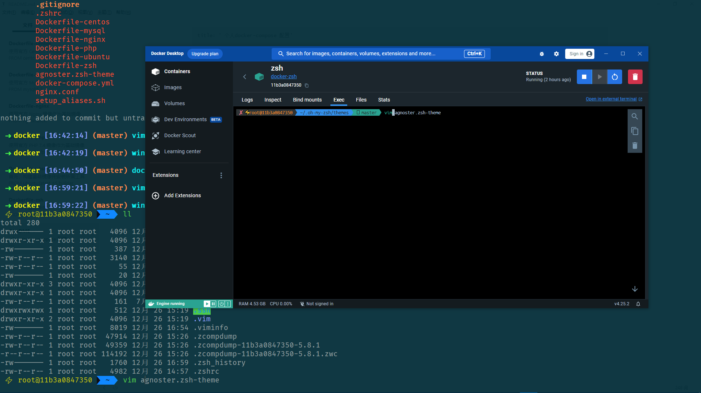

## 前言

> 由于在 Windows 下开发 但是又想使用 zsh shell, 只好自己使用 docker 部署一套, 环境是搞好了, 但是还有个问题困扰着我
>
> 就是从 git-bash 里执行 docker exce 进入容器内部, 输入栏的光标位置与我实际输入的地方始终对不准 总是有一个空格的差距, 而在 docker desktop 里面的终端打开是正常的, 如下图, 仔细看就能发现
>
> 同样都是只输入了 `vim` , 在git-bash终端里面, 光标对准的位置却发生了偏差, 光标跑到了 `vim a` 那里去了
>
> 
>
> 
>
> 
>
> 这个问题十分头疼 折腾许久找不到解决办法, 猜测是使用 agnoster.zsh-theme 主题的自带的特殊符号导致的, 因为尝试过删除特殊符号后就恢复了
>
> 但我仍无法解决如何在保留特殊符号的情况下不会出现那一个空格的偏差, 真是急死强迫症😓
>
> 这个难题就交给未来的我来解决吧

<!--more-->


## 构建环境

```bash
# 根据 docker-compose 配置构造镜像容器
docker-compose build --no-cache && docker-compose up -d

# 启动 Zsh shell, 也可以把 zsh 改成 bash, sh, /bin/sh 等
winpty docker exec -it 11b3a0847350 zsh
```


## 补充

由于**.gitignore**忽略了**.ssh**, pull 代码时记得加上该目录

```bash
cp ~/.ssh .
```

